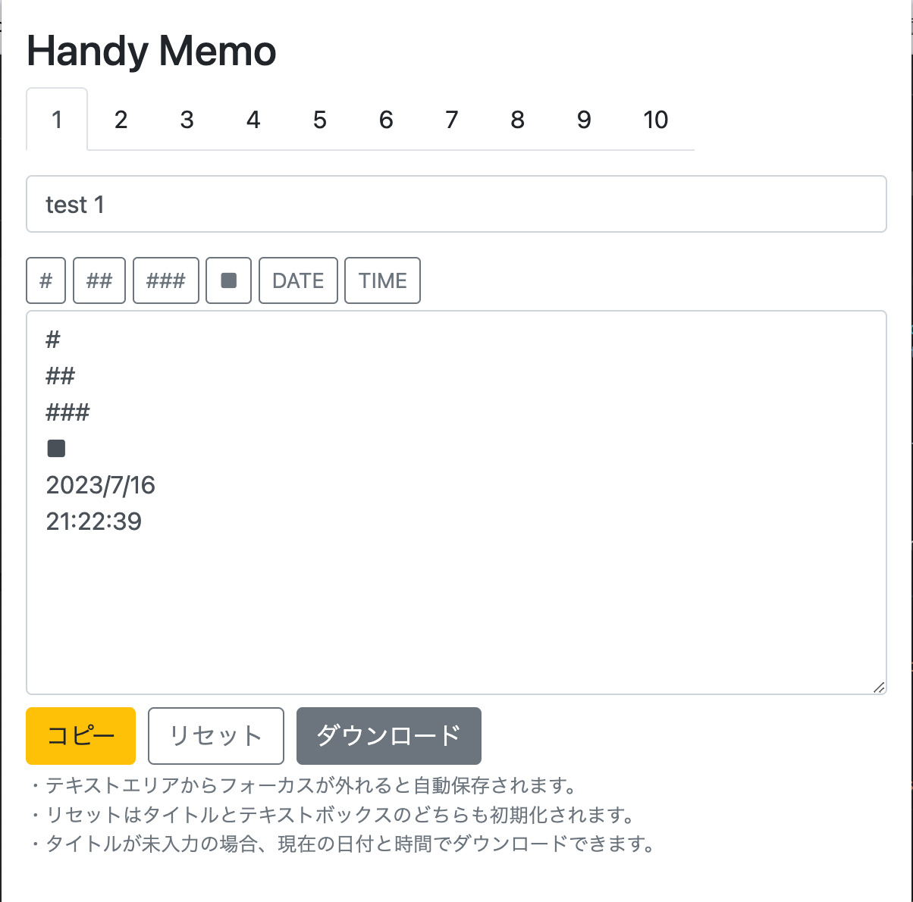
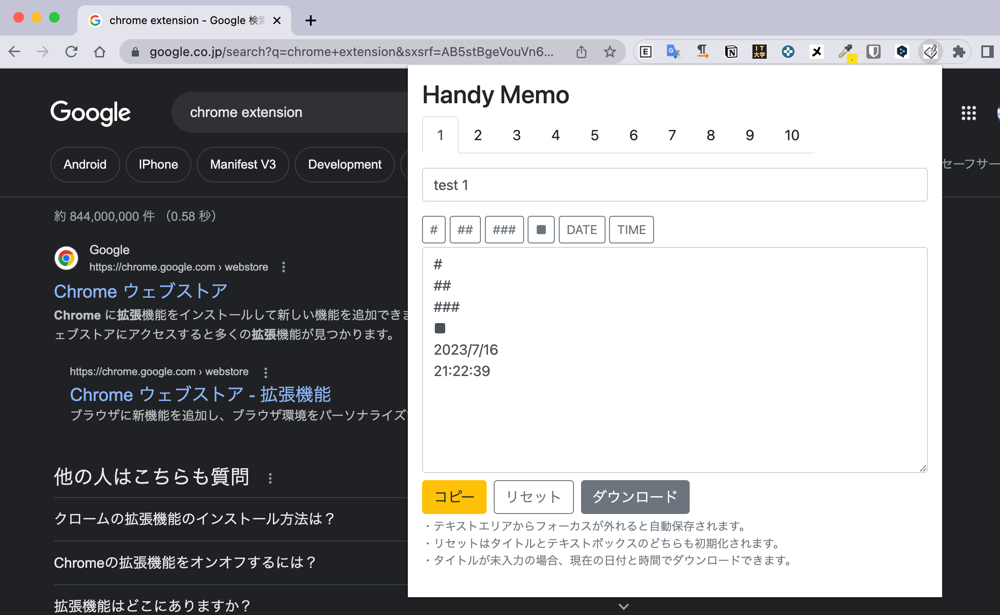

# Handy Memo

## 概要

Chrome拡張機能「Handy Memo」は、Chromeでメモを残すことができる拡張機能です。

ポップアップで表示されるメモのエリアに、タイトルとメモの内容を入力できます。




## インストール方法

Chrome Web Storeには、公開していないので、ソースコードをCloneして、

Chromeの拡張機能のデベロッパーモードで読み込む必要があります。

### ソースコードのClone

```bash
git clone ***
```

### Chromeの拡張機能のデベロッパーモードで読み込む前の準備

npmで必要なパッケージをインストールします。

```bash
npm install
```

ビルドします。

```bash
npm run build
```

`./dist`にビルドされたファイルが出力されます。

### Chromeの拡張機能のデベロッパーモードで読み込む

1. `chrome://extensions/` にアクセスします。
2. デベロッパーモードを`on`にします。
3. 「パッケージ化されていない拡張機能を読み込む」をクリックします。
4. ビルドしたファイル、`./dist`を選択します。
5. 拡張機能が追加されるので、拡張機能の一覧より、`Handy Memo`を固定の設定にします。


### 使い方

ブラウザのアドレスバーの右側にあるアイコンをクリックするとポップアップが表示されます。
あとは、普段利用されているメモアプリと同じように内容を入力するだけです。

最大10件までメモを残すことができます。



### タイトルとメモの保存

タイトルとメモの内容は自動で保存されます。
タイトルとメモの内容は、ブラウザを閉じても保存されます。

### ツールバー

アイコンをクリックすることで特定の文字を入力できます。

- `#` アイコンをクリックすると、`#`を入力します。
- `##` アイコンをクリックすると、`##`を入力します。
- `###` アイコンをクリックすると、`###`を入力します。
- `■` アイコンをクリックすると、`■`を入力します。
- `DATE` アイコンをクリックすると、`YYYY/MM/DD`を入力します。
- `TIME` アイコンをクリックすると、`HH:MM:SS`を入力します。

### 各種ボタン

- コピーボタンをクリックすると、メモの内容をクリップボードにコピーします。
- リセットボタンをクリックすると、タイトルとメモの内容をリセットします。
- ダウンロードボタンをクリックすると、メモの内容を`md`ファイルとしてダウンロードします。
  - タイトルが入力されていない場合は、`YYYY-MM-DD-HH-MM-SS`の形式でファイル名が付与されます。

